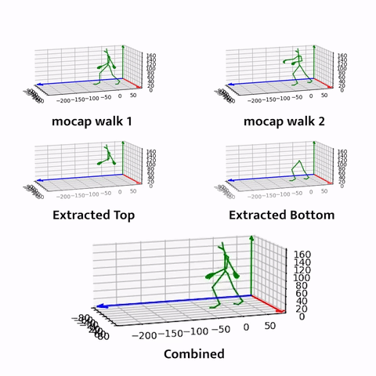

# Assignment 1. Traditional Animation
Ashley Kim (ayk2@andrew.cmu.edu)  
2/13/2023

## Part 1 : Keyframing ##
Using Maya, I made two walkcycles that portray two different moods for each character. 
The first is a slightly excited robot semi-dashing over, and the second is an old zombie trying to take few steps.

For each character that I downloaded from SketchFab, I made my own IK handles and animated the entire walkcycle from start to the end. 

### Walk Cycle 1 : ###

### Walk Cycle 2 : ###

### IK Process ###

Resources:  
* [Robot by Willy Decarpentrie](https://sketchfab.com/3d-models/biped-robot-801d2a245e4a4405a0c2152b35b5e486)
* [Zombie by DJMaesen](https://sketchfab.com/3d-models/zombie-25c230a1e2f2462fa3de298fc8bca30a)

 

## Part 2 : MoCap Editing ##
This part is based on the [start code for miniproject 1](https://github.com/yangyanzhe/assignment1). 

The code can be run by downloading this repo and running `python3 main.py` in terminal. If you have specific bvh files you'd like to combine or have specific destination location for the output to be saved, you can use the optional `--src_path1 SRC1 --src_path2 SRC2 --dst_path DST` flags to indicate them.

I made five modified functions of `load` function:

* `loadTop` : This function sets joints in the bottom half of the body to have offest of (0,0,0) so that any translation or rotation shows in the rendering.
* `loadBottom` : This function sets joints in the upper half of the body to have offest of (0,0,0) so that any translation or rotation shows in the rendering.
* `loadMinusTop` : This function sets rotations of the joints in the upper half of the body to (0,0,0) in Euler so that the motion movement doesn't show.
* `loadMinusBottom` : This function sets rotations of the joints in the lower half of the body to (0,0,0) in Euler so that the motion movement doesn't show.
* `loadTwo` : Taking in two file addresses, this function reads both and combines upper half motion of the body from the first file and lower half motion from the second file. I initially tried to load two animations via `load` then combine the two animation objects (attempt in `combine` function), but I couldn't figure out the translation conflict between Euler rotation in BVH file to Quaternion rotation in Animation object. Instead, I wrote `loadTwo` to combine the data of upper and lower halves of the body from two BVH files.

 

### Example Edit Combination: ### 

Reference:  
* Holden, D., Komura, T., & Saito, J. (2017). Phase-functioned neural networks for character control. ACM Transactions on Graphics (TOG), 36(4), 42.
* [How to Use Starter Code](https://github.com/yangyanzhe/assignment1/blob/master/demo.ipynb)
